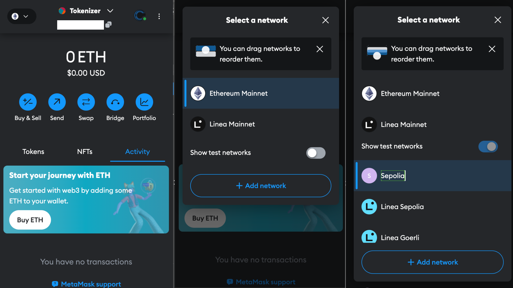
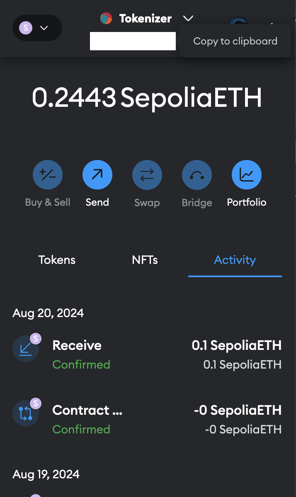

# Creating and Using a Testnet for Smart Contract Development

## 1. Overview

### What is a Testnet?

A **testnet** is an alternative blockchain used for testing and experimentation. In this case, it mimics the main Ethereum network (mainnet) but uses separate tokens with no real-world value. This allows developers to safely test smart contracts without risking real assets.

### What are Test Tokens?

**Test tokens** are free tokens used on testnets to pay for transactions. They replicate the behavior of Ether (ETH) on the mainnet but have no monetary value, making them ideal for testing.

## 2. Install MetaMask

MetaMask is a Web3 wallet required to interact with Ethereum blockchains, including testnets.

### Steps to Install and Configure MetaMask

1. **Install MetaMask**: Download the MetaMask extension from the [official website](https://metamask.io/) and set up a new wallet.
2. **Add Sepolia Testnet**: Click on the Metamask wallet plug-in, log in to the MetaMask wallet, open the testnet in the settings, and switch to Sepolia - as shown in the images below.

    

## 3. Obtain Test Tokens (SepoliaETH)

To interact with the testnet, you need SepoliaETH to cover gas fees.

### Steps to Get SepoliaETH

1. **Access a Faucet**: Visit [Chainlink](https://faucets.chain.link/sepolia) or [Google Cloud Web 3](https://cloud.google.com/application/web3/faucet/ethereum/sepolia) to test tokens.
2. **Claim Tokens**: Enter your MetaMask wallet address to claim SepoliaETH - obtainable on the plug in as shown below Note that faucets often have rate limits, so you may need to wait a certain amount of time before making additional requests.

    

3. **Verify Balance**: Ensure your MetaMask wallet has at least 0.1 SepoliaETH. While the faucets listed do not have a minimum balance requirement, some platforms such as [Sepolia Faucet](https://sepoliafaucet.com) or [Infura Sepolia Faucet](https://www.infura.io/faucet/sepolia) may. 

## Conclusion

With SepoliaETH in your MetaMask wallet, you can now deploy and interact with smart contracts on the Sepolia testne