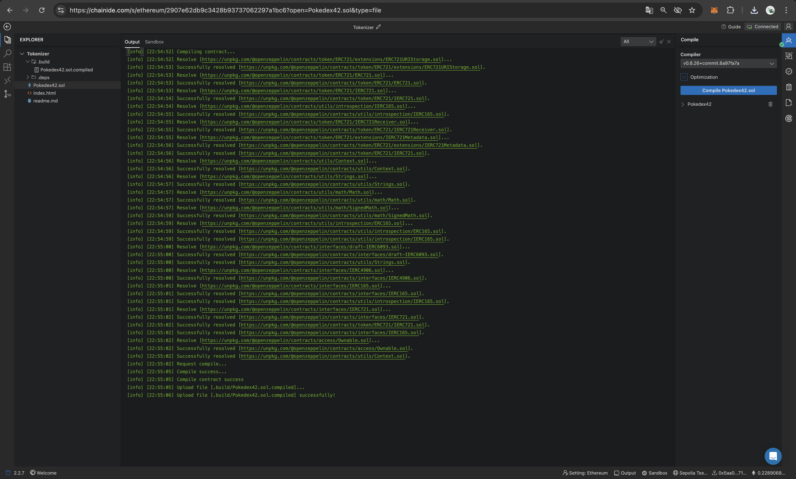
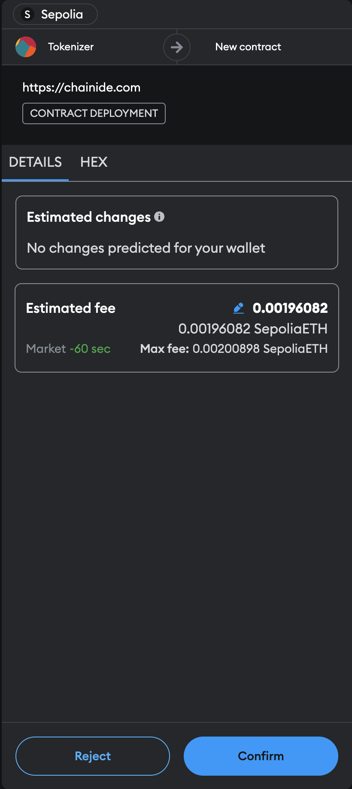
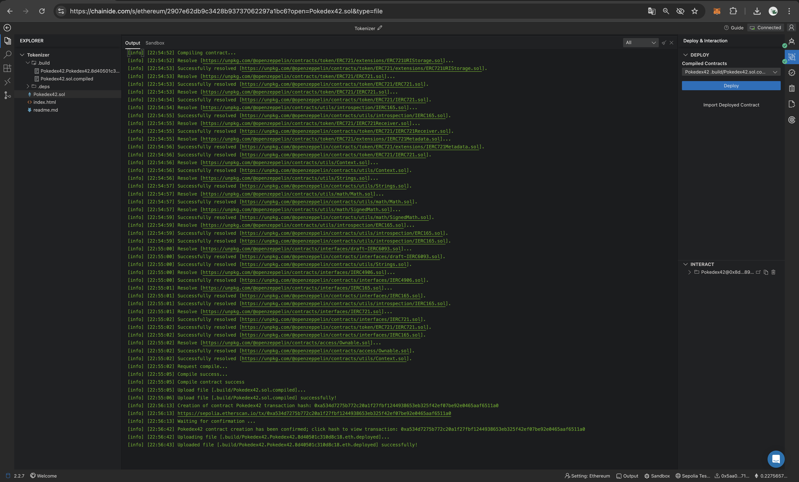
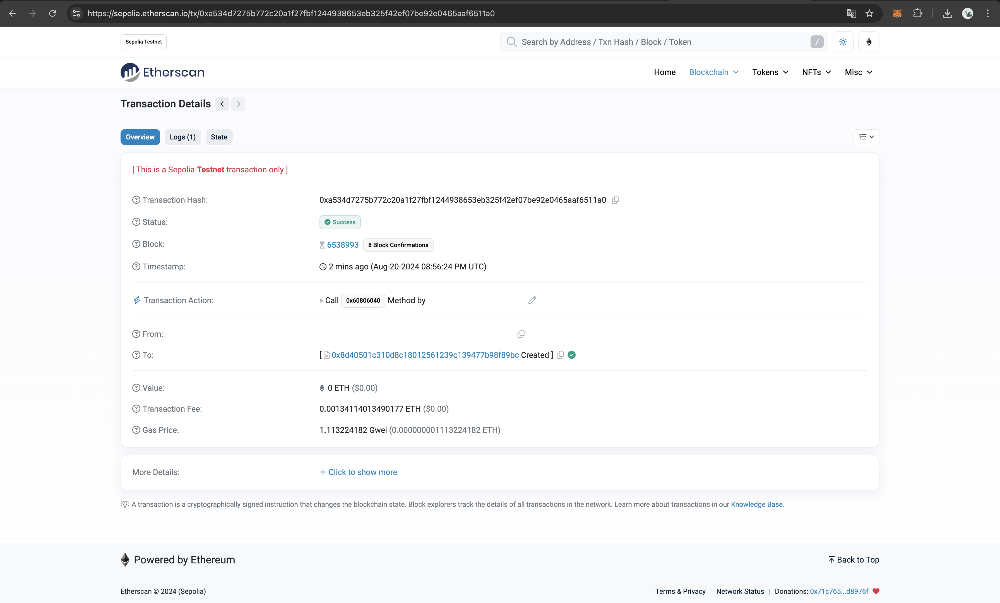
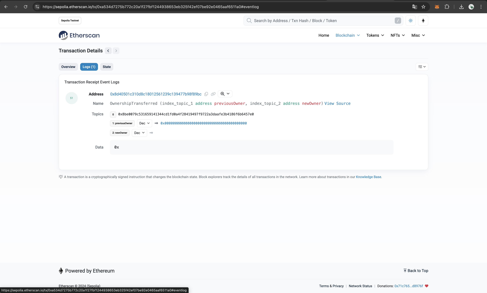

# Pokedex42 Smart Contract Documentation

## Overview

The `Pokedex42` smart contract is an implementation of the ERC-721 standard, which is used to create non-fungible tokens (NFTs) on the Ethereum blockchain. In this specific contract, each token represents a unique Pokémon, and the contract owner has the ability to "catch" (mint) Pokémon for different players.

### Key Features

- **ERC-721 Compliance:** The contract follows the ERC-721 standard for NFTs.
- **Ownership:** The contract uses OpenZeppelin's `Ownable` to restrict certain functions (like minting) to the contract owner.
- **Token Metadata:** Uses `ERC721URIStorage` to associate metadata (e.g., Pokémon details) with each token.

## Contract Code Explanation

```js
pragma solidity ^0.8.20;

import "@openzeppelin/contracts/token/ERC721/extensions/ERC721URIStorage.sol";
import "@openzeppelin/contracts/access/Ownable.sol";

contract Pokedex42 is ERC721URIStorage, Ownable {
    uint256 private _nextTokenId;

    constructor() ERC721("Pokedex42", "P42") Ownable(msg.sender) {}

    function PokemonCatch(address player, string memory tokenURI)
        public
        onlyOwner
        returns (uint256)
    {
        uint256 tokenId = _nextTokenId++;
        _mint(player, tokenId);
        _setTokenURI(tokenId, tokenURI);
        return tokenId;
    }
}
```

The `Pokedex42` contract is designed to create and manage unique Pokémon NFTs. The contract owner can mint new tokens, assigning them to players with associated metadata. The contract keeps track of the next token ID using a private variable `_nextTokenId`. The constructor initializes the contract with a specific name (`Pokedex42`) and symbol (`P42`) for the token, and it assigns ownership to the deployer.

## Compilation Process

### What is Compiling?

Compiling is the process of **converting the human-readable Solidity code into machine-readable bytecode that can be executed on the Ethereum blockchain and can become a permanent and immutable part of the network**. In this case, the deployment is done on the [Sepolia test network](./1-Testnet.md) previously set up.

### Steps to Compile

1. **Select Compiler Version:** Choose the correct Solidity compiler version in your IDE (e.g., ChainIDE). The version must be compatible with your Solidity syntax.
2. **Compile the Contract:** Press the compile button. If the code is correct, the IDE will generate a **`Pokedex42Item.sol.compiled`:** file containing the compiled bytecode and the ABI (Application Binary Interface), which is necessary for interacting with the contract.
3. **Resolve Errors:** If there are any compilation errors, they will be displayed in the output panel. Fix the errors and recompile. Else, a success message should be displayed as in the example below. 

    

## Deployment Process

### What is Deploying?

Deploying a smart contract involves **sending the compiled bytecode to the Ethereum blockchain**, where it becomes a permanent and immutable part of the network. Once deployed, the contract can be interacted with by users and other contracts.

### Steps to Deploy

1. **Connect Wallet:** Ensure your MetaMask wallet is connected to the Sepolia test network.
2. **Deploy the Contract:** In your IDE, go to the "Deploy & Interaction" module. Select `Pokedex42` from the compiled contracts and deploy it. Confirm the transaction in MetaMask.

    

3. **Deployment Output:** Upon successful deployment, you will receive a message indicating the contract has been deployed, along with a transaction hash. The IDE will them generate a deployment file: **`Pokedex42Item.Pokedex42.fa364d3ffa112865.eth.deployed`**, which stores metadata about the deployment, including the contract address and transaction details.

    

### Viewing the Transaction on Etherscan

After deployment, you can view the details of the deployment transaction on Etherscan using the provided transaction hash displayed below or directly see all the details and logs of the transaction, including the gas used, block number, and the deployed contract address on [Etherscan](https://sepolia.etherscan.io/tx/0x0b324ae974aa4388bd7bc518faa22020a37806dd0dd9ef2ae37199ef610aee86) - details and logs displayed below.

**Transaction Hash** : **`0xa534d7275b772c20a1f27fbf1244938653eb325f42ef07be92e0465aaf6511a0`**





## Recap

- **Compilation:** The contract is written in Solidity and compiled into bytecode (`Pokedex42Item.sol.compiled`) using a Solidity compiler.
- **Deployment:** The compiled bytecode is deployed to the Sepolia test network, resulting in the generation of a deployment file (`Pokedex42Item.Pokedex42.fa364d3ffa112865.eth.deployed`).
- **Transaction Verification:** You can verify the deployment transaction on Etherscan using the provided transaction hash.

This process ensures that your smart contract is correctly compiled, deployed, and available for interaction on the Ethereum network.