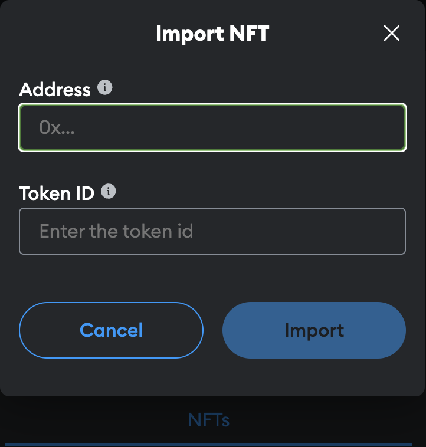

# NFT Minting and Metadata Management with Pinata

## Overview

### What is NFT Minting?

**NFT Minting** refers to the process of creating a non-fungible token (NFT) on a blockchain. When you mint an NFT, you turn your digital asset, such as an image or video, into a unique token that is stored on the blockchain. This process ensures that the asset is verified, traceable, and owned by a specific wallet address.

### What is IPFS?

**IPFS (InterPlanetary File System)** is a decentralized storage network designed to store and share digital files. Unlike traditional web hosting, where files are stored on a central server, IPFS uses a distributed network of nodes to store and retrieve data. Each file is identified by a unique CID (Content Identifier), which is used to access the file from anywhere on the network.

### What is Pinata?

**Pinata** is a service that provides an easy interface for managing files on IPFS. It simplifies the process of uploading files, retrieving CIDs, and organizing content on the IPFS network.

## Steps to Mint NFTs and Manage Metadata with Pinata

### 1. Uploading Images to IPFS Using Pinata

1. **Create a Pinata Account**: Sign up at [Pinata](https://pinata.cloud).

2. **Upload Images**: Log in to your Pinata account. Go to the **Pinata Dashboard** and click **"Upload"**, select **"Files"** and choose the image file you want to upload (e.g., `pikachu.jpeg`). Click **"Upload"** and wait for the process to complete. Once uploaded, you will receive a CID (Content Identifier) for the image.

      

   You can now, click on the uploaded image to view its details and copy the CID for use in the metadata JSON as shown above.

### 2. Creating Metadata JSON

1. **Prepare Metadata JSON File**: Create a JSON file with the required metadata and replace `<Image-CID>` with the CID obtained from uploading your image. In our case, it should give this [json file](./../deployment/NFTs/Pikachu/Pikachu.json):
      ```json
      {
         "name": "Pikachu",
         "description": "A vibrant NFT featuring Pikachu, the iconic Electric-type Pokémon from the Pokémon series. Pikachu is known for its electric abilities and cheerful demeanor.",
         "image": "ipfs://QmcvPvLc7Zvf8NNNum114onFGZ4S8ovQcwnJJqVUbRqHZY", 
         "properties": {
            "type": "Electric",
            "rarity": "Legendary",
            "abilities": [
                  "Thunderbolt",
                  "Quick Attack"
            ],
            "trainer": "Ash Ketchum"
         }
      }
      ```

2. **Upload Metadata JSON to IPFS**: In the Pinata Dashboard, go to **"Upload"** and select **"Files"** to upload your metadata JSON file. After uploading, you will receive a CID for the metadata JSON. Click on the  Click on the uploaded JSON file to view its details and copy the CID for use in the minting process as shown below.

      

   Once again, yu can click on the uploaded JSON file to view its details and copy the CID for use in the minting process as shown below.

### 3. Minting the NFT

1. **Prepare to Mint**: Open your development environment or IDE (e.g., ChainIDE, Remix) and ensure you have the contract address and are configured to interact with the Sepolia testnet on MetaMask.

2. **Interact with the Smart Contract**: Now, head to the **"INTERACT"** panel in your IDE. Locate and use the `PokemonCatch` function of your smart contract : enter the recipient’s wallet address in the "player" field and use the format `ipfs://<Metadata-JSON-CID>` with the CID of your metadata JSON file for the "tokenURI".

   

3. **Submit the Transaction**: Click **"Submit"** to mint the NFT. You will be asked to confirm the transaction in your MetaMask wallet as show below.

   

   Once the trasaction confirm a message should be output confirming the said transaction along side it's own hash :

   

### 4. Verify the Minted NFT

1. **Check on OpenSea**: Once your NFT is minted, you can view it on OpenSea, a popular NFT marketplace where users can buy, sell, and explore NFTs. To do so replace replace contract address in this url :

   ```
   https://testnets.opensea.io/assets/sepolia/[contract address] 
   ```

   This should redirect to your collection on OpenSea and in our case to see all the NFTs minted under the ["Pokedex42" collection](https://testnets.opensea.io/assets/sepolia/0x8d40501C310d8c18012561239c139477B98F89bc)

   

   You can also check out your NTFs by connecting your MetaMask account to OpenSea. Instead of displaying the all the NFTs of the collection it will only display the NFTs that we send to you through different transactions. 

   

2. **Add NTF to MetaMask**: To add your NFT to your MetaMask, you'll have to import manually your NFT using the contract address and token ID of your NFT.

   

   You can find all the necessary information on [Etherscan](https://sepolia.etherscan.io/nft/0x59e634e2a92f0cf6de0cce628c9f67fb7397daff/0)'s details page for the last transaction involving the NFT:

   

   Once the import completed, the NFT in question will me added to your MetaMask NFTs :

   

## Recap

Minting an NFT involves several steps, from uploading your digital assets to a decentralized storage network like IPFS using Pinata, to creating metadata, and finally interacting with a smart contract to mint the token on a blockchain. After successfully minting your NFT, you can view it on platforms like OpenSea, where it will be part of a collection, and add it to your MetaMask wallet for easy access and management. This process ensures that your digital assets are securely stored, uniquely identifiable, and easily transferable on the blockchain, making them truly your own.