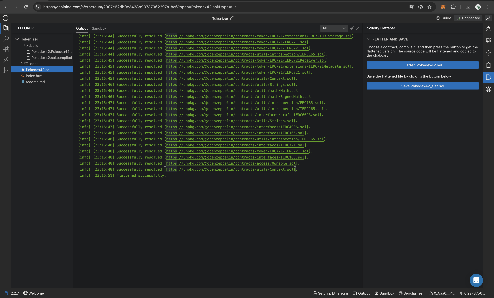
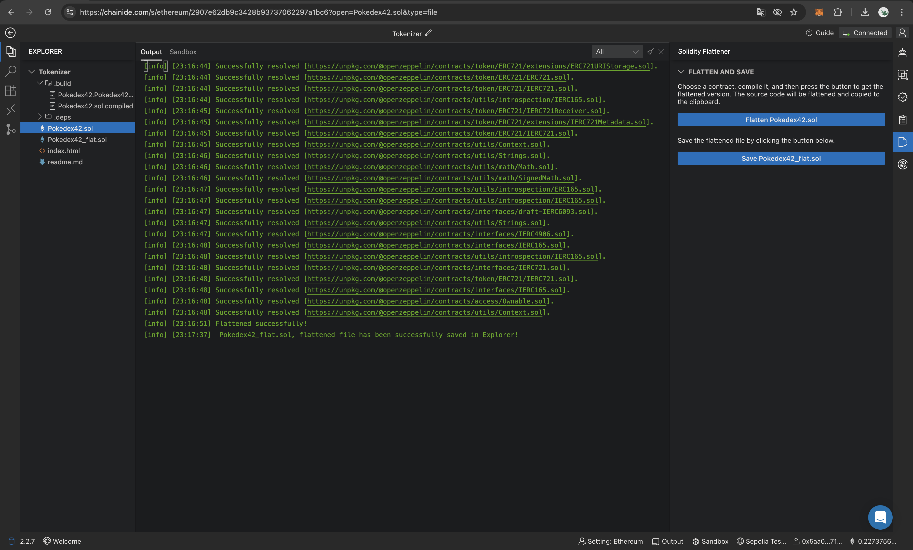
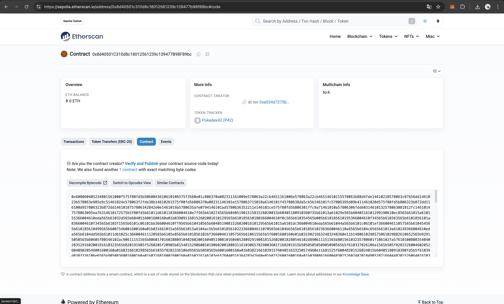
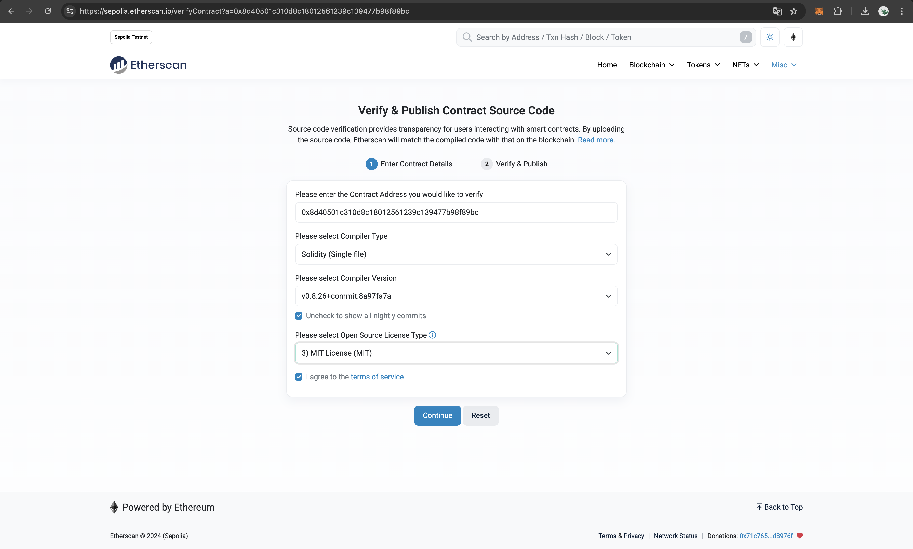
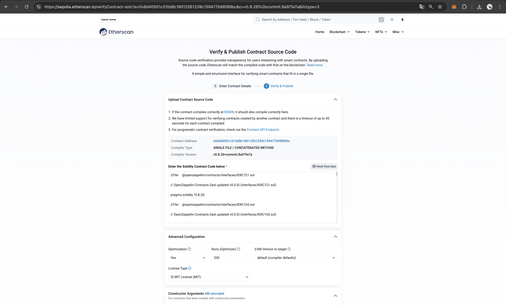
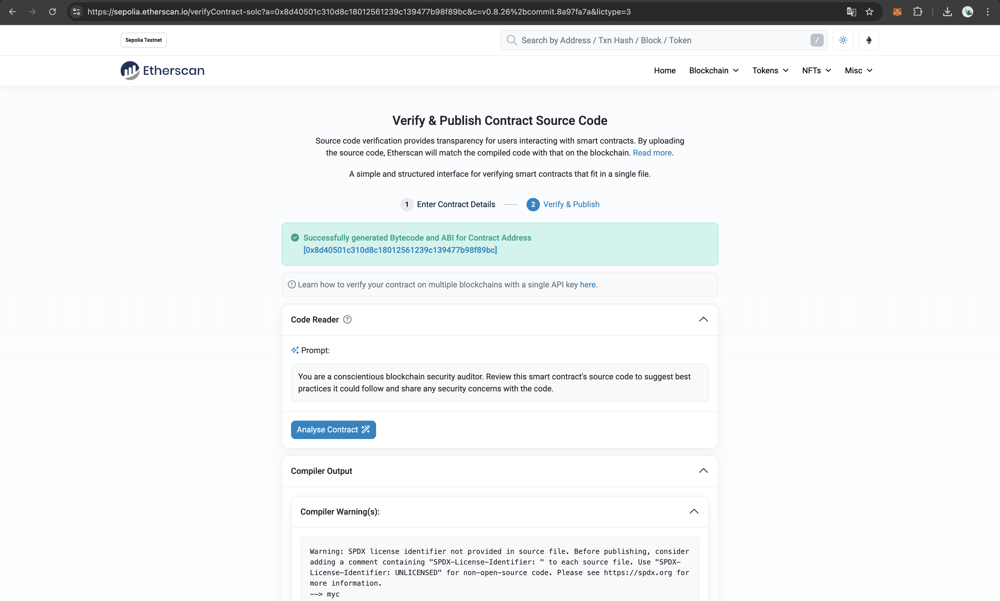
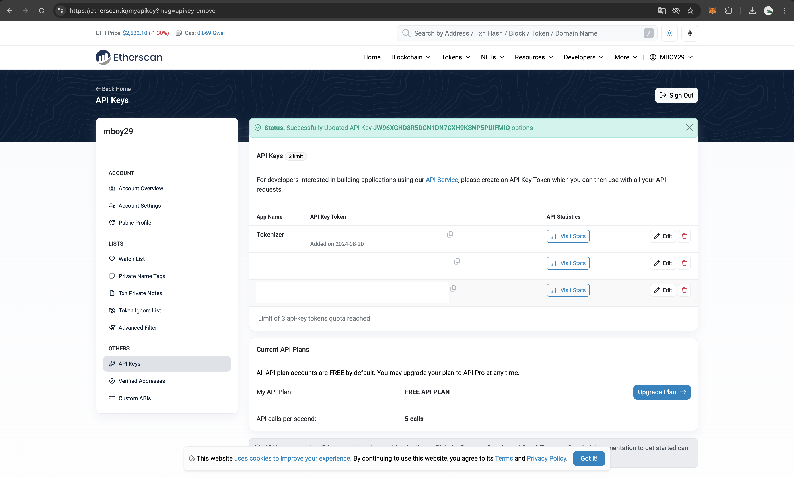
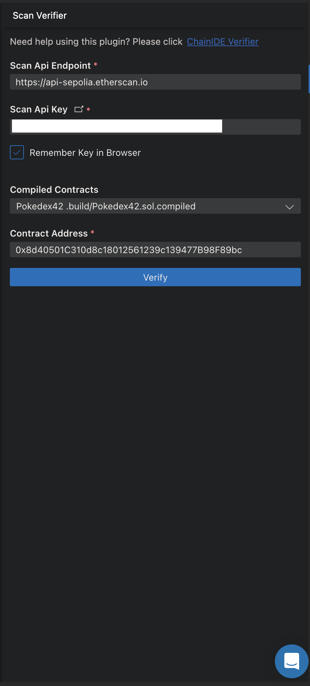
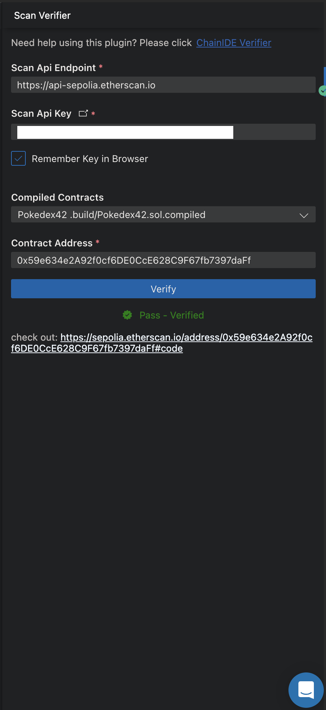
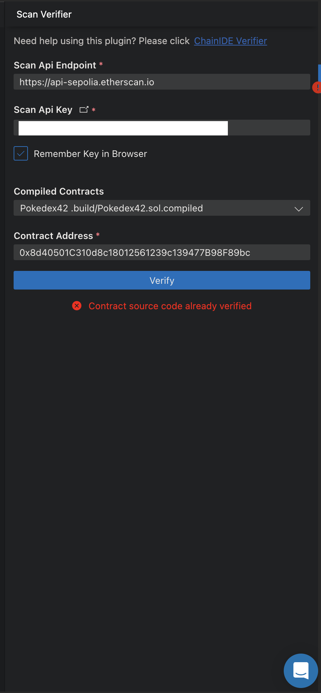

# Verifying the `Pokedex42` Smart Contract on Etherscan

## Overview

Verifying a smart contract is an essential step in the development process. It allows others to view the source code and understand how the contract works, fostering trust and transparency. In this guide, we'll be verifying the `Pokedex42` contract, which we've been working on.

## Key Concepts Before You Start

1. **Smart Contract Verification**: Verifying a smart contract on Etherscan involves proving that the contract's deployed bytecode matches its source code. This process helps others confirm that the contract does what it claims to do.

2. **Flattened File**: Solidity contracts often import other contracts or libraries. A flattened file is a single Solidity file that includes all the necessary code from the imported files. This file is required for verification because Etherscan needs all the code in one place.

3. **Etherscan**: Etherscan is a popular block explorer for Ethereum. It provides tools to verify and publish smart contract source code, making it easier for the community to audit the contract.

## Steps to Verify the `Pokedex42` Contract

### 1. Create a Flattened File Using the Flattener Plugin

1. **Activate the Flattener Plugin**: Open your development environment and navigate to the "PLUGIN Manager" panel. Then, search for and activate the "Flattener" plugin.

2. **Generate the Flattened File**: Once the plugin is activated, select the `Pokedex42.sol` file from your contract directory and click on the "Flatten" button. A message with be output once the process has been completed.

   

3. **Save the Flattened File**: Chain IDE will they suggestion you to save the flattened file. Click on it and the file will be added to the directory (e.g., `Pokedex42_flat.sol`).

   

### 2. Verify the Contract on Etherscan

#### Option 1: Verify via Etherscan Website

1. **Access the Verification Page**: Login to your [Etherscan](https://sepolia.etherscan.io/) account and head to your contract page (e.g., `Pokedex42). In the contract's details page, click on the "Verify and Publish" link under the contract section.

   

2. **Fill in Verification Details**: Once on the page, paste the contract address of `Pokedex42`, choose "Single file" as compiler type since you're using the flattened file, select the Solidity compiler version that was used to compile your contract (e.g., `0.8.20`) and select the license under which your code is published (e.g., `MIT`). Then continue.

   

3. **Upload Contract Source Code**: Now, paste the flattened code you saved earlier in the text area provided and ensure that the "Optimization" settings match those used during compilation.

   

4. **Submit for Verification**: Click the "Verify and Publish" button. If there are no issues, your contract will be successfully verified, and a green checkmark will appear next to it on Etherscan.

   

#### Option 2: Verify via Etherscan API

1. **Activate the Etherscan Verifier Plugin**: Back to Chain IDE, go to the "PLUGIN MANAGER" and activate the `@chainide/etherscan-verifier` plugin.

2. **Obtain an API Key**: Head to [Etherscan](https://sepolia.etherscan.io/), and navigate to the "API Keys" section and create a new API key. 

   

3. **Use the Plugin for Verification**: In the plugin interface, paste our API Key, select `Pokedex42` from the list of compiled contracts, specify it's contract address and click the "Verify" button.

   

   Once completed a success message will be displayed along side a URL
   to your contract information on [EtherScan](https://sepolia.etherscan.io/address/0x59e634e2A92f0cf6DE0CcE628C9F67fb7397daFf#code).

   

   Obviously, not need to verify you contract on Etherscan Website and API as a contract doesn't need double verification.

   

## Recap

Smart contract verification is a critical step in blockchain development that enhances transparency and trust by allowing the community to view and audit your code. This guide walked you through the process of verifying the **`Pokedex42`** smart contract. 

We began by creating a flattened file, necessary for combining all dependencies into a single source file, which is required for verification on Etherscan. We then explored two verification methods: directly through Etherscan’s web interface, and via the Etherscan API using ChainIDE. By completing this process, your contract’s source code is now publicly accessible, contributing to the integrity and credibility of your blockchain project.

