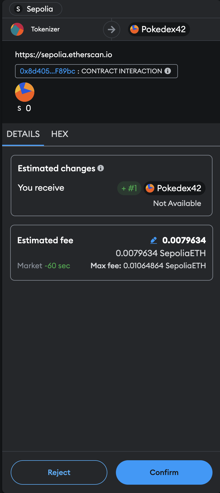

# Minting and Transacting a Jigglypuff NFT with the Verified `Pokedex42` Smart Contract

## Introduction

Now that your `Pokedex42` smart contract is verified on Etherscan, it's fully transparent and trusted by the community. You can interact with it directly using tools like Remix, Etherscan, or through scripts in your development environment. In this guide, we'll walk you through the process of minting a Jigglypuff NFT and transacting it.

## Key Concepts

1. **Smart Contract Interaction**: After verification, you can interact with the smart contract's functions either directly through a blockchain explorer like Etherscan or by using a Web3 interface (such as Remix or a dApp). This interaction can involve minting, transferring, or querying NFTs.

2. **Minting**: This refers to the process of creating a new NFT and assigning it to a user. The `Pokedex42` contract includes a function called `PokemonCatch` that mints an NFT and assigns it to a specific wallet address.

3. **Transacting**: After minting, you can transfer your NFT to another address. This transaction is recorded on the blockchain, ensuring that the ownership of the NFT is updated transparently.

## Steps to Mint and Transfer a Jigglypuff NFT

### 1. Preparing Metadata for Jigglypuff

Before minting, ensure you have prepared the metadata for the Jigglypuff NFT, similar to how we prepared it for Pikachu.

1. **Create Metadata JSON**: Prepare a [JSON file](./../deployment/NFTs/Jigglypuff/Jigglypuff.json) with the metadata specific to Jigglypuff, including its name, description, the CID of an image uploaded to Pinata, and properties like type, rarity, and abilities.

    ```json
    {
        "name": "Jigglypuff",
        "description": "Jigglypuff, known as Rondoudou in French, is a Fairy-type Pokémon recognized for its ability to put opponents to sleep with its enchanting lullaby. This NFT captures Jigglypuff's cute and bubbly essence.",
        "image": "ipfs://QmQ4zjmrvhAXk5MUpZZVsUxNmcaqLFtVX51r1bo3ZsbRdX", 
        "properties": {
            "type": "Fairy",
            "rarity": "Common",
            "abilities": [
                "Sing",
                "Pound"
            ],
            "trainer": "None"
        }
    }
    ```

2. **Upload Metadata to IPFS**: Once again, use a service like Pinata to upload this JSON file to IPFS. This will give you a CID (Content Identifier) for the metadata.

    

### 2. Minting the Jigglypuff NFT

1. **Access the Contract on Etherscan**: Go to the contract’s page on Etherscan. You can access the "Write Contract" section to interact with the contract.

2. **Authenticate with MetaMask**: Connect your MetaMask wallet to Etherscan if you haven’t already.

3. **Execute the `PokemonCatch` Function**: Go to the `PokemonCatch` function in the "Write Contract" section. Now, enter the recipient's wallet address in the `player` field and specify the CID of your Jigglypuff metadata JSON in the `tokenURI` using the `ipfs://<Metadata-JSON-CID>`.

    

    Then, click "Write" and confirm the transaction in MetaMask.

    

4. **Transaction Confirmation**: Finally, once the transaction is confirmed on the blockchain, your Jigglypuff NFT will be minted and assigned to the specified address.

    

    A button will be able to views the transaction details, as desplayed above.

    

5. **Check the NFT on OpenSea**: Once the transaction confirmed, you're new NFT should be visible in your collection on OpenSea. Access it using the following URL formtat:
    ```
    https://testnets.opensea.io/assets/sepolia/[contract address]
    ```

    This should redirect you to your collection and display your new NFT alongside your old ones (e.g., [**`Pokedex42`**](https://testnets.opensea.io/assets/sepolia/0x8d40501C310d8c18012561239c139477B98F89bc)).

    

    Once again, you can also check out your NTFs by connecting your MetaMask account to OpenSea. Instead of displaying the all the NFTs of the collection it will only display the NFTs that we send to you through different transactions. 

    

5. **Import your NTF to MetaMask**: Now import your new NFT to your MetaMask Wallet by using the import functionality and by specifying the contract address and the token ID.

    

### 3. Transferring the Jigglypuff NFT

1. **Create a Second MetaMask Account**: Set up a new account in MetaMask to serve as the recipient of the Jigglypuff NFT. This is useful for testing purposes, allowing you to simulate a transfer to another user without involving a third party.

2. **Initiate the NFT Transfer**: Using Etherscan, make sure your EtherScan is link to you MetaMask. The renavigate to the `Pokedex42` contract page and go to the "Write Contract" section (e.g., [**Pokedex42**](https://sepolia.etherscan.io/address/0x8d40501C310d8c18012561239c139477B98F89bc#writeContract)). Select 
the `transferForm` function in the "Write Contract" and enter the required details :
    - **From Address**: The current owner's address (your primary MetaMask account).
    - **To Address**: The recipient’s address (the second MetaMask account you created).
    - **Token ID**: The unique identifier of the Jigglypuff NFT you wish to transfer.
    Then, click "Write" to initiate the transfer and confirm the transaction in MetaMask when prompted. 

    
   
4. **Confirm Transaction**: Once again the current owner will have to confirm the transaction using MetaMask.

    

3. **Verify the Transfer**: Once the transaction is completed you will be able to see details of the transaction on [EtherScan](https://sepolia.etherscan.io/tx/0xedf947bd16a43d50736d2d71cb36d39f4017a877a0df74a71c09d01143ff2122)

    

    Finally, the transfered NFT will no longer be displayed on the original user's OpenSea collection, as it has to be transfered to someone else.

    

    It will now be on the recipient's collected NFTs.

    

## Recap

In this guide, you've learned how to use the verified `Pokedex42` smart contract to mint and transfer a Jigglypuff NFT. The process includes:

1. **Interacting with the Verified Contract**: Understanding that after verification, you can interact with the contract through Etherscan or Web3 interfaces.
2. **Minting**: Creating a new NFT by using the `PokemonCatch` function with the appropriate metadata.
3. **Transferring**: Moving the NFT to another user by executing a blockchain transaction.

This ensures that the NFTs you create are unique, traceable, and securely owned by the intended recipient.

